[[_TOC_]] 

## [1] Einleitung

SARS-CoV-2, oder umgangssprachlich das Corona-Virus, hält die Welt seit Monaten in Atem. Von einer eingebrochenen Wirtschaft, über Reise- und Ausgangsverboten, bis hin zu einer vollständigen Beeinträchtigung des gesamten öffentlichen und privaten Lebens: Die einschneidenden Konsequenzen von Corona hinterlassen Spuren und es scheint nicht, als würde es zu einer rapiden Besserung in den nächsten Wochen und Monaten kommen. Daher ist es umso entscheidender zu verstehen, was dieses Virus überhaupt ist, wie es sich ausbreitet und welche Personengruppen besonders geschützt werden müssen. Daraus ergibt sich, welche Präventivmaßnahmen zu ergreifen sind.

Die Forschung arbeitet auf Hochtouren, um Informationen über dieses neuartige Virus zu sammeln. Dabei werden täglich neue Erkenntnisse gewonnen und mittels wissenschaftlicher Arbeiten publiziert. So sind nach heutigem Stand bereits über 200.000 akademische Artikel veröffentlicht worden. Das Problem, was sich nun stellt, ist, dass kein Wissenschaftler der Welt - und daher erst recht nicht der normale Bürger - die Möglichkeit hat, bei diesen rasanten Veröffentlichungszahlen alle Artikel zu lesen und sich ein jederzeit aktuelles Wissen über SARS-CoV-2 anzueignen. Es verlangt also eine maschinelle Bearbeitung dieser Ausarbeitungen, um den Erkenntnisgewinn zu erleichtern.

Vor diesem Hintergrund hat die Datenplattform Kaggle mehrere Wettbewerbe ausgerufen, die Data-Scientists dazu aufruft, kreative Lösungsansätze für die Analyse der gesammelten Publikationen zum Thema Corona zu entwickeln. Dieser umfassende Wettbewerb gliedert sich in eine Reihe von Aufgaben, die als eigenständige Kategorien zu bearbeiten sind. Da ein Impfstoff nicht in greifbarer Nähe scheint, soll diese Arbeit nun darauf abzielen, Erkenntnisse über Faktoren, welche ein erhöhtes Risiko zur Ansteckung oder einen schwereren Krankheitsverlauf provozieren, zu sammeln. Diese Information kann zu einer Sensibilisierung beitragen, die die Folgen von Corona im besten Falle reduziert. Da es in der gegebenen Bearbeitungszeit nicht möglich ist das breite Spektrum von Risikofaktoren zu erfassen, wird hier ein Fokus auf die Raucher gesetzt. Laut dem Bundesministerium für Gesundheit ist ungefähr jeder vierte Bürger Raucher und damit betroffen. Aus diesem Grund wollen wir auf Basis einer enormen Sammlung von wissenschaftlichen Publikationen das Rauchen als Risikofaktor im Zusammenhang mit Corona erforschen.

## [2] Grundlagen und Stand der Technik

### [2.1] Herausforderung Big Data

Das Ziel von Natural Language Processing (NLP) ist die Analyse von Sprache, die oft in Form von Text vorliegt. Herausforderung ist allein die Masse an Daten, welche manuell nicht zu bewältigen ist und auch die Computertechnik an ihre Grenzen treibt. Betrachten wir zunächst einmal wesentliche Charakteristiken der Datenverarbeitung:

- Wachsende Datenquellen (Vergrößerung der Datenbestände circa alle 18 Monate)
- Speicher wird billiger, Rechenleistung steigt nicht proportional zur Größe der Datenmenge

Daraus ergibt sich die Schlussfolgerung, dass kein einzelner PC mehr die Datenmenge alleine verarbeiten, geschweige denn im Hauptspeicher aufnehmen kann. Man erkennt also, dass eine vertikale Skalierung durch beispielsweise Erhöhung der Rechenkapazität oder durch mehr Speicher nicht zielführend ist. Ein besserer Ansatz ist es, horizontal zu skalieren: Das bedeutet, dass mehrere Rechner zu einem Cluster zusammengeschlossen werden, um die Last an Daten verteilt zu speichern und zu verarbeiten.

Zur verteilten Berechnung hat sich das Open-Source Framework Spark in Kombination mit dem Hadoop Filesystem etabliert. Des Weiteren eigenen sich funktionale Sprachen (in unserem Falle: Scala) optimal zum verteilten Rechnen, weil deren Algorithmen - im Gegensatz zu objektorientierten Sprachen - tendenziell zustandslos sind und daher leichter im Cluster transferiert werden können. Funktionale Abläufe lassen sich meist leichter in einzelne Teilschritte zerlegen. Insbesondere Operationen wie Filter, MapReduce und GroupBy sind hier zentral. Sie bilden die Grundlage des Hadoop-Frameworks, welches wiederum eng verwandt mit Spark ist.

### [2.2] Spark

#### [2.2.1] Spark Frameworks

Apache Spark ist ein Framework für Cluster-Computing, welches im Jahre 2014 erschien. Es ermöglicht eine performante Verarbeitung von großen Datenmengen und bietet High-Level-APIs für Java, Scala, Python und R an. Spark besteht aus 4 essenziellen Architekturkomponenten:

- **Spark Core** ist die Grundlage des gesamten Spark-Systems. Infrastukur-Funktionalitäten wie Ein- und Ausgabe, Scheduling oder auch Aufgabenverteilungen finden Ihren Ursprung in diesem Modul. Spark führt eine neue Datenstruktur für die Arbeit mit diesem Framework ein: das RDD (*Resilient Distributed Dataset*). Bei dieser Datenstruktur handelt es sich um ein Bestand von Daten, welcher über mehrere Rechner verteilt werden kann, ohne das es zum Datenverlust kommt. 
- **Spark SQL** ist eine Erweiterung von Spark Core und bietet eine noch höhere Abstraktionsebene zum RDD. Diese verteilten Datenmengen werden in einem sogenannten DataFrame aggregiert. Auf dieser Datenebene können SQL-ähnliche Anfragen durchgeführt werden, sodass einfache und performante Selektionen, Projektionen, Joins, Gruppierungen und vieles mehr ermöglicht werden.
- **Spark ML** ist eine Funktionsbibliothek. Es ermöglicht Machine-Learning-Algorithmen für verteilte Spark-Systeme anwendbar zu machen. 
- **Spark Streaming** ermöglicht die Verarbeitung von Datenströmen. Sie werden in einzelne Pakete unterteilt, auf welchen dann weitere Transformationen effizient angewendet werden können.

#### [2.2.2] Spark NLP

Spark NLP ist eine Natural Language Processing Bibliothek, welche nativ auf Spark ML aufgebaut ist und diese damit erweitert. Es handelt sich hierbei um ein Framework, das eine sehr hohe Genauigkeit aufweist und aufgrund seines CPU- und GPU-Optimierung sehr performant und schnell ist. Es skaliert auf verteilten Systemen effizient und liefert von Hause aus sehr viele vortrainierte Pipelines und Modelle in über 46 Sprachen mit.

### [2.3] Python

#### [2.3.1] Jupyter Notebook

Jupyter Notebook (früher IPython Notebooks) sind ein Produkt der Non-Profit-Organisation Project Jupyter. Es eine web-basierte interaktive Umgebung, in der komplexe Dokumente erstellt werden können. Es eignet durch seine Simplizität perfekt für Datenexplorationen, da dort direkt Grafiken, Code und Text in einem Schritt zusammengefasst werden können.

#### [2.3.2] SpaCy

SpaCy ist - wie auch Spark NLP - eine Natrual Language Processing Bibliothek, welche jedoch auf Python basiert. Sie eignet sich gut dafür, mit wenigen Zeilen Code komplexe Modelle zu erstellen, und bietet in Kombination mit dem Jupyter Notebook die Möglichkeit, aussagekräftige Grafiken zu generieren. Da Scala und Spark im Fokus des Seminars lagen, wurden mit SpaCy keine Kernthematiken des Projekts geklärt. Für die Datenexploration hingegen bleibt diese Python-Bibliothek gerade in Kombination mit den etablierten Visualisierungstools in Jupyter Notebooks ungeschlagen.

### [2.4] Wichtige Algorithmen

Da in dem Projekt mehrere komplexe Algorithmen zum Einsatz gekommen sind, sollen hier die theoretischen Grundlagen der interessanteren Verfahren erläutert werden:

#### [2.4.1] Vektorisierung und Hashing

Vektorisierung (oder die spezifischere Form: Word Embedding) beschreibt den Prozess der Abbildung eines Text-(Abschnittes) mittels eines definierten Vokabulars auf einen Vektor im Bereich der reellen Zahlen. Allgemeiner gesprochen sorgt es für eine Reduzierung der Dimensionen des Input-Raumes auf eine performantere prozessierbare Darstellung. Auf Grundlage der Vektorisierung ist es dann möglich, MinHashing anzuwenden, um eine weitere Beschleunigung von Ähnlichkeitsanalysen zu erreichen.

##### [2.4.1.1] Vectorization am Beispiel von Word2Vec

Bei der Vektorisierung der Daten gibt es verschiedene Ansätze, aber viele bauen im Prinzip auf die Wahrscheinlichkeiten, die ein bestimmtes Wort hat, in der Nähe eines anderen Wortes aufzutauchen. Skip-gram ist eine Variante von Word2Vec.

**Beispiel:** 

Nimmt man den bekannten Satz *“The quick brown fox jumps over the lazy dog”*, dann stellen wir fest, dass unser Korpus die Worte *the, quick, brown, jumps, over, lazy, dog* umfasst. Stellen wir eine Fenstergröße von 2, also 2 Wörter links und rechts des Wortes ein und würden das Wort **brown** betrachten sind die Wörter *the*, *quick*, *fox* und *jumps* teil der Betrachtung: “{*The quick* **brown** *fox jumps} ...” Es sind also 4 einzigartig vorkommende Wörter im Betrachtungsfenster, dem sogenannten Kontext. Damit beträgt die Wortwahrscheinlichkeit pro Wort 0,25. In der nachfolgenden Tabelle sind die Wahrscheinlichkeiten für alle einzigartigen Worte des Korpus dargelegt. Betrachtet man Zeile 3, finden sich hier die errechneten Werte wieder.

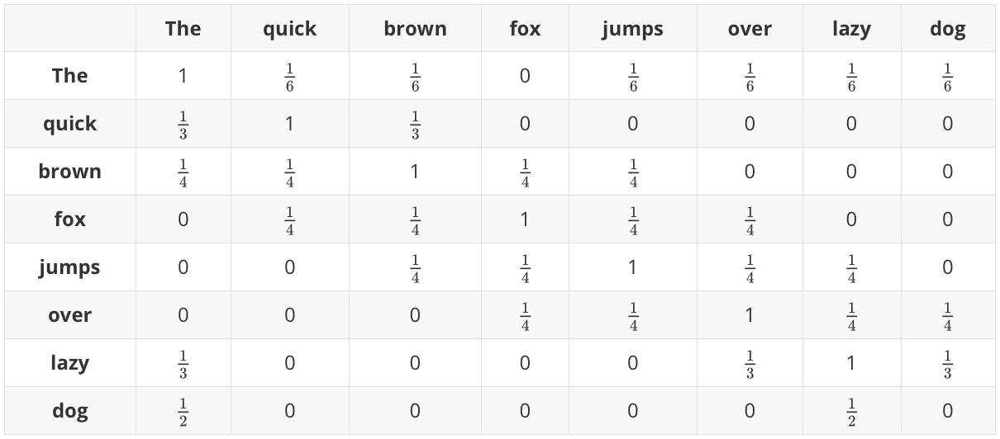

Diesen Wahrscheinlichkeitsvektor übergibt man einem neuronalen Netzwerk mit 2 Layern als Input. Hierbei sind die Targets k die einzigartigen Wörter mit ihren Werten.

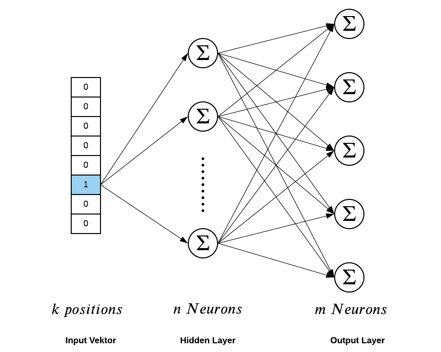

Sobald das Modell konvergiert, sind die Gewichte des Hidden Layer, die Word Embeddings. Man kann somit durch die Anzahl der Neuronen kontrollieren, wie lang die Vektoren werden. Dieses Verfahren lässt sich auf beliebig große Textkorpora anwenden. Ein so trainiertes Modell kann synonyme identifizieren oder Wortergänzungen vorschlagen. 

Allgemein gesagt, gibt es viele Methoden wie Word2Vec, welche Embeddings erzeugen, jede mit Vor- und Nachteilen und unterschiedlicher Performanz und Spezialisierung. Insbesondere wenn es darum geht, ganze Sätze, Absätze oder Dokumente zu vergleichen, differenzieren sich Ansätze auseinander.

##### [2.4.1.2] SPECTRE

Im Fall des CORD19 Datensatzes sind die sog. Document-Embeddings mit [SPECTRE](https://arxiv.org/pdf/2004.07180.pdf) aufgebaut worden. SPECTRE ist ein Verfahren, welches statt auf Wort und Token basierter Ebene (wie Word2Vec) eine Ähnlichkeit auf der Dokumentensicht herstellen soll. Dies ist deshalb interessant, weil die reine Textebene oft nicht ausreicht, um 2 Dokumente miteinander zu vergleichen. Insbesondere bei wissenschaftlichen Publikationen ist dies schwer, weil ein stark domänenspezifischer Korpus die Vergleiche hindert, eine gute Aussagekraft auf Wortebene herzustellen. SPECTRE ist darauf ausgelegt, den Zitationsgraphen der Paper auszunutzen, um Embeddings zu erzeugen und braucht darüber hinaus kein aufwendig zusammengestelltes, domänenspezifisches Vokabular, um mit neuen Dokumenten umzugehen.

## [3] Methodik und Daten-Exploration

In diesem Kapitel sollen die allgemeine Arbeitsstrategie und die Ergebnisse der Daten-Explorationsphase dargestellt werden.

### [3.1] Methodik und Untersuchungsplanung

Die Arbeit wird in folgenden Teilschritten umgesetzt: 

1. **Exploration der Daten**

   Die explorative Analyse der Daten ist Grundlage der Konzeptionsphase. Idealerweise liefert dieser Prozessschritt einen guten Überblick über die vorhandenen Daten sowie erste Ideen für mögliche Arbeitsstrategien. Die Exploration erfolgt primär mithilfe von Plots in Jupiter Notebooks.

2. **Konzeption und Wahl der Werkzeuge**

   Auf die Exploration folgend werden die Ideen zu einem Konzept weiterentwickelt, welches das Projekt im weiteren Verlauf bestimmen wird. Entscheidend für die Wahl der spezifischen Zielsetzung ist die Berücksichtigung des zeitlichen Rahmens. Im Optimalfall wird ein Ziel definiert, welches sowohl zeitlich als auch technisch machbar ist und möglicht wenig Umsetzungsrisiko birgt. Grobe Meilensteine sind aufzustellen, damit die einzelnen Arbeitspakete fristgerecht abgeschlossen werden. Da dieses Projekt neben der eigentlichen Forschung auch das Erlernen der Werkzeuge und Programmiertechniken erfordert, werden in der Konzeptionsphase auch verschiedene Libraries und Frameworks evaluiert. Ziel ist es, die angemessenen Technologien zu identifizieren und zumindest in einen Umfang zu erlernen, der eine feinkörnigere Arbeitsplanung ermöglicht. Insofern schließt die Konzeption auch das Schreiben von experimentellen Code ein.

3. **Implementation der Datenpipeline**

   In dieser Phase wird die Basis für das Experiment gelegt. Die Datenpipeline ausprogrammiert und mit kleineren Teildatensätzen stufenweise getestet. Da in diesem Schritt weitere Erkenntnisse über NLP-Techniken gewonnen werden, muss die initiale Zielsetzung gemäß der Machbarkeit angepasst werden. Dies ist in der Forschung vielleicht unüblich, in diesem Grundlagenseminar aber notwendig. Zusätzlich werden bereits im laufenden Prozess Dokumentationen angefertigt, um die folgenden Arbeitsschritte zu erleichtern und Teilergebnisse im Team auszutauschen.

4. **Durchführung Experiment**

   Sobald die Pipeline implementiert wurde, kann das eigentliche Experiment durchgeführt werden. Die Anwendung wird zusammen mit den Daten auf einen Rechencluster transferiert und dort ausgeführt. Dies kann mehrere Durchläufe erfordern, da Lücken im Datensatz schnell Fehler verursachen, die beim Testen der Pipeline nicht erkannt wurden. Die Ausführung der Pipeline ist rechen- und arbeitsintensiv und sollte in der Planung dementsprechend ein größeres Zeitfenster erhalten.

5. **Repräsentation der Ergebnisse**

   Da die durch das Experiment erhaltenen Daten schwer bewerten sind, benötigen wir eine Präsentationsschicht, die Ergebnisse erfahrbar macht. Dafür eigenen sich vermutlich zwei Ansätze: 1. Plots und Diagramme können - wie schon in der Datenexploration - genutzt werden, um die zentralen Aussagen zu visuell aufzubereiten. Dies würde eine statische Ergebnisanalyse mit Jupiter Notebook implizieren. 2. Die resultierenden Daten könnten für ein interaktives Artefakt genutzt werden - z. B. eine Webseite oder Suchanwendung.

6. **Evaluation und Dokumentation**

   Mit Ablaufen des Bearbeitungszeitraums wird das bis zu diesem Zeitpunkt Umgesetzte aufbereitet und dokumentiert. Diese schließt die technische Dokumentation und inhaltliche Aufbereitung der Thematik ein.

### [3.2] Daten Exploration

Hinsichtlich des großen Datensatzes wurde zunächst eine explorative Analyse vorgenommen. Der Datensatz umfasst ca. 150.000 Paper als JSON Dateien, Metadaten und dazu passende Dokument-Embeddings. Ziel der Exploration ist es, ein Gefühl für die Daten zu bekommen und erste Erkenntnisse zu gewinnen, die uns für den weiteren Projektverlauf gewinnbringend sein können. Um vorhandene Ideen zu schärfen und ihre Machbarkeit zu überprüfen stützen wir uns auf folgende Auswertung.

#### [3.2.1] Publikationszeitraum

Über die vorhandenen Metadaten war es möglich, jeder Veröffentlichung einen Publikationszeitpunkt zuzuordnen. Dadurch konnte der Datensatz auf seine Aktualität hin untersucht werden. Ergebnis der Darstellung ist die unten abgebildete Kurve. Diese ist so interpretierbar, als dass der Datensatz vorwiegend aus Veröffentlichung besteht, welche in den letzten Jahren publiziert wurden. Es wurde eine logarithmische Skalierung der Y-Achse gewählt, da der überwiegende Teil der Texte sich klar auf den zentralen Jahren der Pandemie (2019-2020) sammelt. Dies ist zu erwarten, da es sich um einen neuartigen Virus handelt. Gleichzeitig gibt es aber auch einige wenige Rückgriffe bis hin in die 80er, die vielleicht von besonderem Interesse für die Analyse langfristiger Entwicklungen sind.

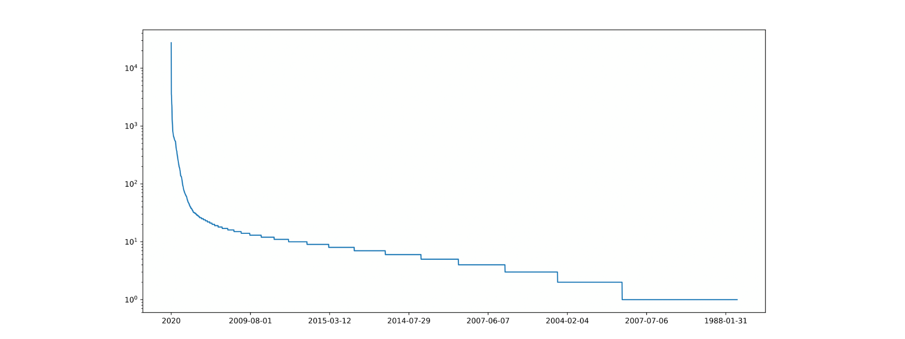

#### [3.2.2] Sprachen der Publikationen

Weiterhin wurde mittels Natural Language Processing (NLP) auf Basis eines SpaCy-Modells analysiert, in welcher Sprache die Veröffentlichungen vorliegen. Dies ist wichtig, um eventuell einige Texte aus einer NLP-Pipeline auszuschließen, die vorwiegend mit englischen Sprachkonstrukten arbeitet. Hierbei wurde die Grundannahme gemacht, dass der Titel einer Publikation in der selben  Sprache verfasst ist wie dessen Textkörper und Zusammenfassung. Ergebnis der Analyse ist, dass ein Großteil der Publikationen in englischer Sprache verfasst ist, jedoch ein nicht unerheblicher Anteil auch in bis zu mindestens 34 identifizierten Sprachen. Daneben gibt es mindestens eine unidentifizierbare Sprache im Datensatz.

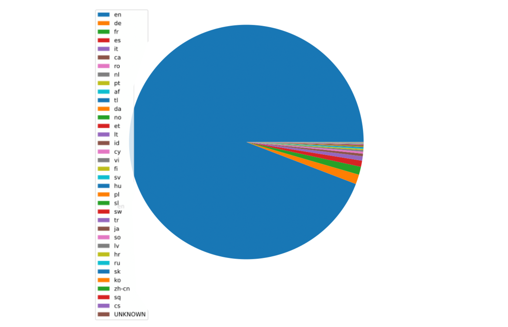

#### [3.2.3] Vokabular & Häufige Worte

Um Publikationen thematisch einzuordnen, war es insbesondere interessant, sich einen Überblick über die in den Überschriften verwendeten Worte zu verschaffen. Hierfür wurden die häufigsten Wörter gezählt und als Histogramm dargestellt. 
Offensichtlich ist, dass die meisten Publikationen in einer Weise COVID-19, Studie, Patient etc. erwähnen. Eine Sammlung dieser Wörter ist hilfreich, da sie in den meisten Texten vorkommen und diese somit nicht unterscheidbar machen. Im Kontext von Covid könnte man sie als Stop-Words bezeichnen. Wollen wir die Studien besser unterscheiden, dann kann ein Entfernen dieser Gemeinplätze notwendig werden.

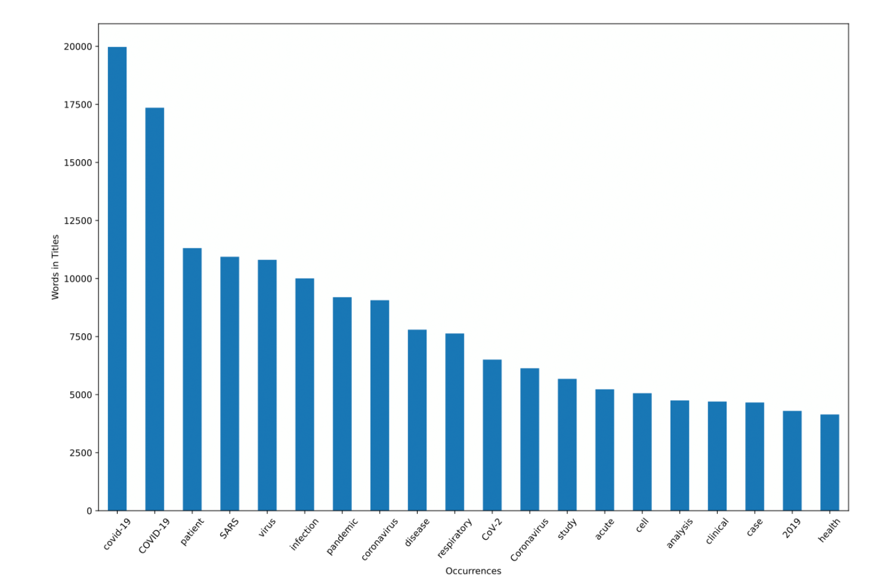

#### [3.2.4] Dokumentähnlichkeit - Embeddings

In Hinsicht auf die Arbeitsvorgabe, Risikofaktoren für COVID-19 zu ermitteln, ist besonders das Rauschen in den Fokus gerückt.
Mit Hilfe der im Datensatz vorhandenen Document-Embeddings wurden in einem weiteren Schritt die relative Ähnlichkeit untersucht. Hierfür wurde vorangehend untersucht, welche Publikationen Wörter enthalten, die im Zusammenhang zum Thema Rauchen stehen. Bei dieser Unterscheidung wurde eine Wortliste verwendet, welche entsprechend mit Texten der Publikationen abgeglichen wurde. Kam ein in der Liste vorkommendes Wort, das in Relation zum Thema Rauchen steht vor, so wurde dieses Paper in den Scatterplots Orange gefärbt. Die restlichen Publikationen sind blau markiert.

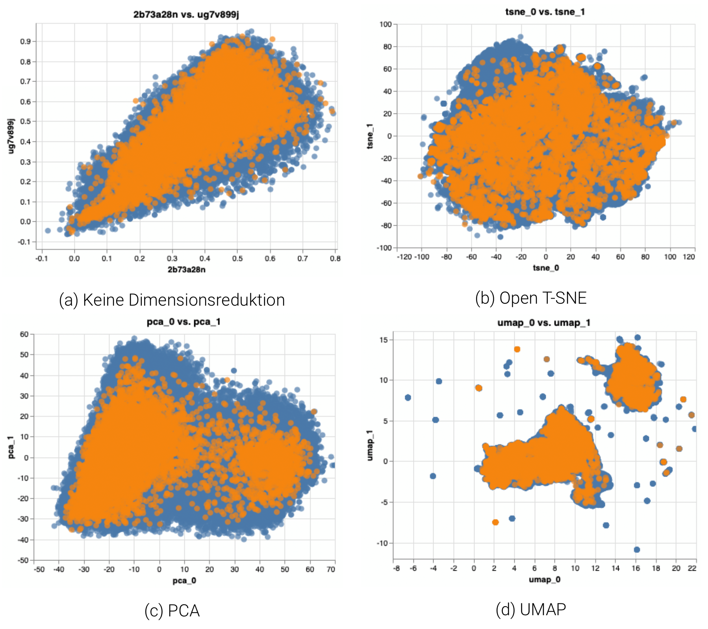

Die Embedding-Vektoren im Datensatz weisen eine Form von  [1 x 768] auf und sind somit hochdimensional. Daher war es notwendig diese auf zwei Dimensionen zu reduzieren, um Gruppierungen innerhalb der Embeddings besser zu erkennen. Die verschiedenen Abbildungen zeigen hierbei die Unterschiede, die die Anwendung von diversen Reduktionsalgorithmen produzieren.

Die farbliche Abhebung der Gruppen zeigt, dass sich die Gruppe der "smoking papers" und die Gruppe der "non-smoking Papers'' nicht stark auseinanderdifferenzieren. Alle orangen Punkte verteilen sich stets in ähnlicher Weise wie die blauen Veröffentlichungen, in denen die gesuchten Schlagworte nicht vorkamen. Es ist also abzuleiten, dass die Veröffentlichungen sich vorwiegend beiläufig mit dem Thema Rauchen als Risikofaktor beschäftigen.

#### [3.2.5] Fazit Exploration

Mit den Erkenntnissen wurde der Ansatz des Projekts verfeinert. Die Paper sind vorerst nicht weiter inhaltlich zu bewerten, da die Methode zur qualitativen Bewertung im gegebenen Zeitfenster nicht zielführend ist. Grundsätzlich sind die Nachweise kausaler Abhängigkeiten extrem schwer zu führen - gerade bei einer sprachlichen Analyse. Das Ziel weiterer Entwicklung muss daher sein, die Daten so aufzubereiten, dass man als Fachwissenschaftler ein Werkzeug erhält, um weiterführenden Analysen zu beginnen. Da die Risikofaktoren (wie Rauchen) in vielen Texten als Randbemerkungen auftreten, benötigen wir ein System, das diese Auszüge erfasst, leicht zugänglich und vergleichbar macht. Dabei spielt der Rückbezug auf den Kontext eine erhebliche Rolle.

## [4] Konzeption

Wie im Fazit der Explorationsphase angegeben, zielt das Projekt nicht darauf ab direkt die kausale Abhängigkeit von Rauchverhalten und schweren Corona-Krankheitsverläufen zu ermitteln. Fundierte Aussagen in diesem Bereich wären vor dem Hintergrund der Datenmassen nicht in der gegebenen Zeit zu treffen. Ein Blick in die auf der Kaggle-Plattform eingereichten Beiträge verdeutlicht, dass sich die meisten Arbeiten zunächst auf das Sichten und Reorganisieren der Publikationen richten. Es werden vor allem Sammlungen erstellt, die als Grundlage für weitere Forschungsarbeiten dienen können. Ein solcher Ansatz schützt auch vor fehlerhaften Behauptungen, die bei unsachgemäßer Zusammenstellung und Deutung von Statistiken leicht in den Raum geworfen werden.

### [4.1] Forschungs-Toolbox

Das Konzept dieser Arbeit ist es demnach ein Werkzeug zu erstellen, dass selbst nicht primär Schlussfolgerungen trifft, sondern eine gerichtete Einsicht der Datenlage ermöglicht. Wir sind uns dabei bewusst, dass auch die Auswahl von Daten bereits den wissenschaftlichen Prozess formt. Als Werkzeug soll eine Webanwendung als Mini-Suchmaschine entstehen, die es ermöglicht, die Texte der gesammelten Publikationen auf Paragrafen zu untersuchen, welche den gewählten Risikofaktor betreffen. Des Weiteren sollen die Paragrafen auf Satzebene weiter analysiert und ähnliche Aussagen auffindbar gemacht werden.

Das Projekt gliedert sich konzeptuell in zwei Hauptkomponenten:

1. **NLP:** Die Natural-Language-Processing Pipeline, in der der die Ausgangsdaten analysiert und aufbereitet werden. Dabei steht die Extraktion der für die Fragestellung wesentlichen Informationen im Vordergrund. Es geht also um eine Reduktion der Datenmasse durch geeignete Filterung. Daneben entstehen neue Metadaten (Annotationen), die die weitere Verarbeitung der Auszüge erleichtern. Wie bereits in der Einleitung angedeutet, fokussiert diese Arbeit auf den Risikofaktor Rauchen. Allerdings soll die Pipeline generisch gehalten werden. Somit wäre sie bei leichter Anpassung von Konfigurationsdateien ohne Weiteres auf andere Felder anzuwenden.
2. **WebApp:** Eine Webanwendung, die eine Einsicht in die erzeugten Datenartefakte ermöglicht und einen Anwendungsfall durchdekliniert. Diese interaktive Webseite fungiert als Präsentationsschicht für die Resultate der Pipeline und dient als Werkzeug für die zukünftige Erforschung des Datensatzes. Es ist leicht vorstellbar, dass sich mit Hilfe dieser Plattform weitere Datenexplorationen vornehmen lassen, die als Basis für tiefergehende Forschungsarbeiten genutzt werden könnten.

### [4.2] Use Case

Im Folgenden soll kurz der Anwendungsfall als Userstory abgebildet werden. Wir stellen uns dazu vor, wie ein Nutzer die Webseite erfährt und sich durch die einzelnen Optionen hangelt. Hier ist anzumerken, dass es sich bei der Applikation um eine reduzierte, prototypische Implementation handlen wird, die sicher viele Erweiterungsmöglichkeiten bietet.

1. **Anforderungen:** Der Nutzer möchte die Publikationen mit dem Ziel durchforsten, Hinweise auf einen Zusammenhang zwischen Rauchverhalten und schweren Verläufen Covid-Infektion zu finden. Wenn er/sie einen interessanten Anhaltspunkt gefunden hat, dann sollen ähnliche Aussagen geprüft werden. Um die einzelnen Sätze stets im Kontext betrachten zu können, ist eine leichte Navigation zwischen Satzfokus und Paragrafenebene zu gewährleisten.
2. **LandingPage:** Bei Eingabe der Basis-URL landet der Anwender auf einer Seite, die es ihm erlaubt, zufällig ausgewählte Paragrafen aus dem Textbestand einzusehen. Alle Paragrafen enthalten aber zumindest einen Satz, der sich auf das Thema Rauchen bezieht. Dieser Satz ist entsprechend hervorgehoben.
3. **Satz Erforschen:** Wenn sich der Nutzer für eine aussage besonders interessiert, kann er diese auf Satzebene weiter erforschen. Er/Sie gelangt auf eine neue Seite, die die markierten Sätze eines Paragrafen in den Vordergrund rückt. Hier finden sich weitere Informationen zum Abbau: Nomen, Adjektive und andere Sprachelemente sind farblich differenziert, wesentliche Risikoworte hervorgehoben.
4. **Ähnliche Sätze:** Besonders wichtig scheint der Vergleich mit ähnlichen Aussagen. Somit können Sätze angeordnet werden, die strukturell verwandt sind.
5. **Kontext ähnlicher Sätze:** Um die Einbettung eines in 4. erhaltenen Satzes zu bewerten, ist von diesem Sprachauszug aus der gesamten Paragrafen abrufbar. Von dort aus geht es dann wieder in weitere Aussagen. Der Navigationskreis schließt sich.


***

## [5] Implementation und Durchführung

Im Folgenden sollen die zwei Hauptanwendungen des Projekts im Detail vorgestellt werden.

1. **SaclaNLP:** Die NLP-Pipeline, welche die Sprachanalyse verteilt durchführt.
2. **ScalaWebPlay:** Die Webanwendung, welche die Resultate erfahrbar macht.

### [5.1] NLP Processing

Im Folgenden wird die Teilanwendung vorgestellt, welche auf das Cluster transferiert wird, um die Sprachanalyse durchzuführen. Diese Datenpipeline produziert vor der eigentlichen Endanwendung die Datenartefakte, welche die performante Suche ermöglichen.

#### [5.1.1] Pipelines in Spark ML & Spark NLP

Im Bereich maschinelles Lernen ist es üblich, eine Sequenz von Algorithmen zu erstellen, welche Daten Schritt für Schritt verarbeiten, um schließlich aus dem Resultat zu lernen. Eine derartige Sequenz bezeichnen wir als Pipeline. Eine Pipeline ist in Spark ML eine Aneinanderreihung von Stufen, wobei jede dieser Stufen entweder ein Transformator oder ein Estimator (Schätzer) sein kann. Unsere Daten laufen in Form von DataFrames durch diese Stufen und werden in jedem Schritt verändert. Jede Stufe verfügt über eine `transform(data)` -Methode, die den Datensatz aktualisiert und an die folgende Stufe weiter reicht. Durch das Pipeline-Konzept wird auch gewährleistet, das Trainings- und Testdaten durch den gleichen Prozess laufen.

**Estimator:** Ein Estimator ist ein trainierbarer Algorithmus (wie zum Beispiel ein neuronales Netz oder ein Entscheidungsbaum). Das bedeutet, dass dieser Algorithmus Daten benötigt, um von ihnen zu lernen - sich also an diese anzupassen. Daher verfügen Estimatoren über die Methode `fit(data)`, welche den entsprechenden Prozess auslöst. Nach diesem Trainingsdurchlauf erhalten wir aus dem Estimator einen Transformator.

**Transformator:** Wie der Name vermuten lässt, wandeln Transformatoren Daten um und erzeugen somit neue Datenartefakte. Ein Transformator kann durch Training aus einem Estimator gewonnen werden oder einfach ein nicht-lernender (fixer) Algorithmus sein. Im Kontext von Spark ML bedeutet Transformation, dass ein Eingabe-DataFrame genutzt wird, um einen neuen (meist erweiterten) DataFrame zu erzeugen.

**Annotator:** Spark NLP führt als Erweiterung zu Spark ML noch eine weitere Nomenklatur ein, Annotator (oder Anmerker). Annotators basieren auf den Transformators und Estimators von Spark ML. Der Begriff dient also eher der Abgrenzung vom besagten Framework. Gleichzeitig verweist er auf den Umstand, dass die Eingabe-Daten zumeist eine Untermenge der Ausgabedaten sind, d. h. der DataFrame wird um weitere Spalten erweitert oder mit Anmerkungen versehen. Die Struktur dieser neuen Spalten verweist auch auf Informationen, die in vorangegangenen Spalten enthalten sind. Um die Unterteilung von Transformator und Estimator abzubilden, gibt es bei Spark NLP: `AnnotatorApproach >> Estimator` und `AnnotatorModel >> Transformator`. Um die Verwirrung komplett zu machen, wird bei `AnnotatorModel` auf das `Model`-Suffix verzichtet, wenn der Transformator nicht über einen Trainingsprozess generiert wurde. Dies ist wichtig, um einfache Transformatoren von Modellen, welche oft aus dem Netz geladen werden müssen und recht speicherintensiv sind, zu unterscheiden.

Spark NLP bietet eine Unzahl von Transformatoren und vortrainierten Modellen, die viele gängige Schritte bei der Verarbeitung von Text und Sprache durchführen können. Dazu kommen die Module, welche bereits im Spark ML-Framework zu finden sind. Die folgende Abbildung zeigt exemplarisch einen Durchlauf eines DataFrames über eine Pipeline-Sequenz. Die jeweils gelisteten Namen sind die nach und nach addierten Tabellenspalten:

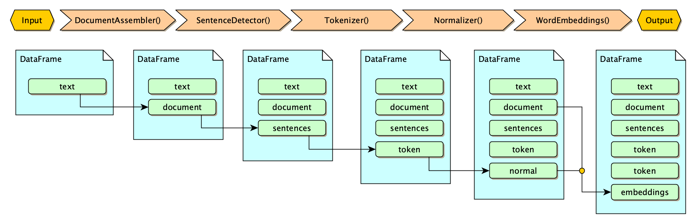

#### [5.1.2] Pipeline-Klassen

Um die Pipelines aus den verschiedenen Modulen zusammen zu setzen, wurde in diesem Projekt entsprechende Klassen für jede Pipeline erstellt. Diese bekommen benötigte Parameter sowie die SparkSession im Konstruktor hereingereicht. Die einzelnen Stufen werden hier instanziiert (bzw. geladen, wenn es sich um vortrainierte Modelle handelt) und anschließend konfiguriert (Hyperparamter). Der Datenfluss durch die Module wird festgelegt, indem jeweils Spalten des Eingabe-DataFrames als Input festgesetzt und Namen für die Ausgabespalten definiert werden. Diese müssen durch alle Transformatoren hinweg konsistent bleiben. Um Fehler bei der Benennung zu vermeiden (insbesondere String-Typos), wurden zuvor all Spaltennamen in einem `Keys`-Object als Konstanten definiert. Daher wird hier stets auf dieses zugegriffen, um die Strings einzufügen. In einem letzten Schritt werden die Stufenmodule in ein Pipeline-Objekt aus dem Spark ML-Framework als Array übergeben. Wird die nun fertige Sequenz via `run(dataFrame)` aufgerufen, dann durchlaufen die Eingabedaten alle Stufen, um schließlich die Ausgabe zu retournieren. Es sei hier darauf hingewiesen, dass durch die Verkettung über Spaltennamen nicht nur ein einziger Strang (lineare Kette) möglich wird. Auch Verzweigungen und Verschmelzungen (bei mehren Input-Spalten) sind zu realisieren. Der oben genannte Array legt nur die Reihenfolder der Ausführung fest, nicht aber zwingend den Datenfluss.

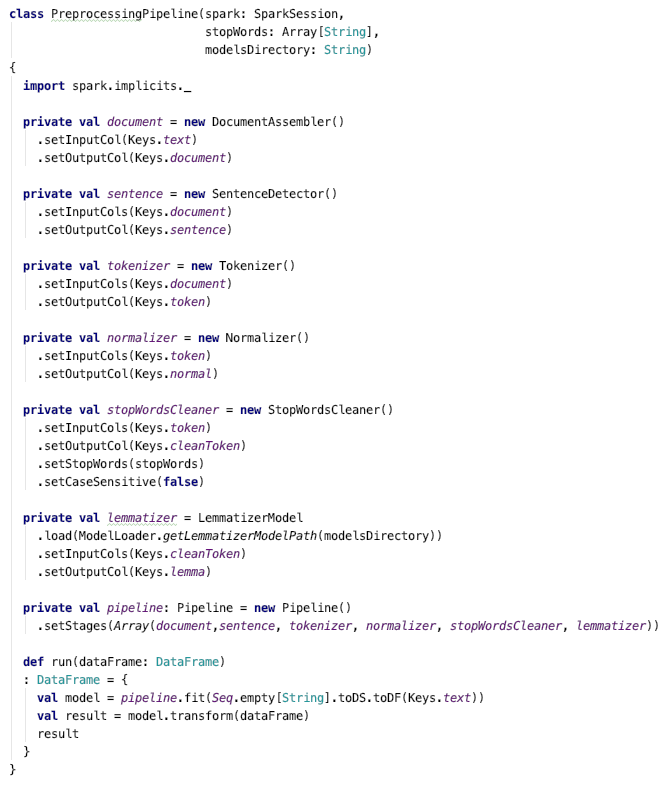

#### [5.1.3] Experiment-Klassen

Auch wenn das Pipeline-Konzept sehr mächtig und letztendlich Kern dieser Arbeit ist, gibt es einige Schwierigkeiten beim Einsatz von Framework-Komponenten: Um die Pipeline-Klasse aus dem Spark ML bzw. NLP Framework um eigene Module erweitern zu können, müssten Transformatoren entstehen, die exakt der Struktur der vorhandenen Module entsprechen. Dies produziert einen erheblich Mehraufwand und viel Boilerplate-Code, der innerhalb dieses Projekts nicht zu rechtfertigen ist. Hinzu käme die lange Einarbeitungszeit in die genauen Details der Implementierung. Eine gute Lösung ist der Einsatz von mehren Pipelines in Folge. Zwischen den einzelnen Pipeline-Durchläufen lassen sich gut neue Transformatoren einsetzen, die nur einem geringeren Aufwand genügen müssen. Die Organisation des Datenflusses durch mehrere Pipelines und neu erstellte Zwischenmodule regeln wir innerhalb der Experiment-Klassen. Ein weiterer Vorteil dieser Strategie legt darin, dass sich Teilschritte isoliert ausführen lassen. Dies erleichtert die Inspektion und Fehlerbeseitigung. Daneben können als Zwischenstand Datenartefakte gespeichert werden, die auch für das Endergebnis relevant sind. Die Experiment-Klassen moderieren somit auch das Abspeichern der Resultate sowie das Lesen der Eingabedaten. Im Folgenden sei der Ausführungsfluss des Experiments `Indicator-Analysis` diagrammatisch dargestellt.

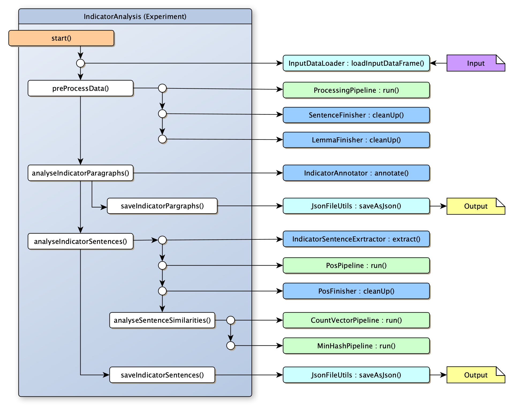

#### [5.1.4] Genutzte Transformatoren

Dieser Abschnitt stellt eine Art Glossar für die in diesem Projekt genutzten Transformatoren und Modelle bereit. Gleichzeitig werden Besonderheiten der von Spark ML bzw. NLP bereitgestellten Implementierungen angerissen.

##### [5.1.4.1] Tokenizer

Der Tokenizer ist für die Zerlegung des Textes in einzelne Tokens (Wörter bzw. Zahlen) zuständig. So können einzelne Analysen auf Wortbasis stattfinden. Da das Wort der atomare Bestandteil eines Textes ist, kommt keine der hier genutzten Pipeline ohne Tokenisierung aus.

##### [5.1.4.2] Normalizer

Der Normalizer ist für Aufräumarbeiten zuständig. Sein Job ist ungewollte Zeichen herauszufiltern. So können beispielsweise Klammern, Kommata oder auch Zeichen herausgefiltert werden, welche in der ausgewählten Sprache keine Bedeutung haben.

##### [5.1.4.3] Lemmatizer

Der Lemmatizer hat als Aufgabe die Worte zu ihrer Grundform zurück zu konjugieren bzw. zu deklinieren. Dabei werden die Worte in ihre substantive, singulare Form transformiert. Dadurch, dass es unregelmäßige Formen einzelner Worte - und keine universale Regel - gibt, muss dies mithilfe eines Wörterbuchs beziehungsweise eines trainierten Modells geschehen.

##### [5.1.4.4] StopWordsCleaner

Der StopWordsCleaner löscht alle Wörter aus dem Text, welche wenig Bedeutung haben. Er löscht über ein Wörterbuch bereitgestellte Füllworte, welche sowohl inhaltlich als auch semantisch dem Text keinen Mehrwert bieten. So kann die Datenmenge verringert werden. Dies ist insbesondere für die Vokabularbildung und die spätere Vektorisierung relevant.

##### [5.1.4.5] SentenceDetector

Der SentenceDetector teilt den Text in einzelne Sätze ein. So wird sowohl eine Analyse zwischen Dokumenten, Paragrafen als auch einzelnen Sätzen ermöglicht.

##### [5.1.4.6] CountVectorizer

Ziel der Vektorisierung ist der effiziente Vergleich von Satzpaaren. Durch diesen Vergleich sollen schließlich zu jedem Satz eine Reihe von ähnlichen Aussagen gefunden werden. Vektorisierung ist die Darstellung von Sätzen in Vektorform. Sie erlaubt es, mathematische Operationen zum Ermitteln einer Distanz zu verwenden, die ein Maß für Ähnlichkeit ist. Der in der Pipeline verwendete `CountVectorizer` aus dem Spark ML-Framework arbeitet in zwei Schritten: In der Trainingsphase werden zunächst die n häufigsten Wörter aus dem Corpus ermittelt und indiziert (0 bis n - 1), wobei n die gewählte Länge des Vektors ist. Danach werden die Wörter eines Satzes vor dem Vokabular gezählt und die Trefferwerte für jedes Wort m aus n an der m-ten Dimension des Vektors eingetragen. Dies entspricht einem Hot-Encoding, jedoch mit einem Wertebereich, der auch größer als 1 ausfallen kann.

##### [5.1.4.7] MinHashLSF

Aufbauend auf den CountVectorizer kann der MinHashLSF seine Arbeit beginnen. Für das sogenannte MinHashing wird der Jaccard-Koeffizient genutzt. Um die Distanz zweier aus natürlichen Zahlen bestehender Mengen zu berechnen, teilt man die Mächtigkeit der Schnittmenge durch die Mächtigkeit der Vereinigungsmenge beider Mengen.

```d(A,B) = 1-|A ∩ B|/|A ∪ B|```

Da diese Berechnung für jede einzelne Menge - konkret: ein vektorisierter Satz - in Kombination zu jedem anderen Satz zu aufwendig ist, kommt noch das Locality-sensitive hashing (LSH) zum Einsatz. Die Idee dabei ist es, ähnliche Inputvektoren in gleiche Buckets zu unterteilen. Daher approximiert man die Elemente in den zusammengefassten Buckets und berechnet lediglich für die einzelnen vorgeclusterten Mengen die Distanz.

 So verringert sich die Rechenzeit enorm. Um das Einteilen in die unterschiedlichen Eimer zu ermöglichen, wendet MinHashing eine zufällige Hashfunktion g auf jedes Element in der Menge an und nimmt das Minimum aller Hashwerte:

```h(A) = min(g(a)) mit a ∈ A```

#### [5.1.5] Custom Annotators

Da mit den durch das Framework vordefinierten Annotators nicht alle Vorhaben realisiert werden konnten, war es nötig, auch Weitere zu implementieren. Diese dienem vorwiegend der Umstrukturierung und Bereinigung von DataFrames sowie der Extraktion der für das Projekt essenziellen Informationen. Die entsprechenden Klassen sind zwar keine Transformatoren, die sich direkt in eine Spark NLP-Pipeline einklinken lassen, sie erfüllen aber ganz ähnlich Funktionen. Um den Aufwand zu reduzieren, organisieren wir hier den Datenfluss manuell über die Experiment-Klassen.

##### [5.1.5.1] IndicatorAnnotator

Dieser Annotator wird genutzt, um für uns relevante Texte heraus zu filtern, also jene, welche etwas mit Rauchen zu tun haben. Es werden sowohl die Sätze boolesch markiert als auch die Indizes der Wörter, welches zu dieser Klassifizierung beigetragen haben. Diese String-Indizes sind Textkoordinaten relativ zum Paragrafen. Auf Basis dieser Informationen können Indikator-Worte später visuell gekennzeichnet (Highlighting) werden. Diese Verknüpfung von Information über Textkoordinaten ist sehr fundamental für das Annotatoren-Konzept in Spark NLP.

##### [5.1.5.2] IndicatorSentenceExtractor

Hier werden auf Grundlage des IndicatorAnnotators die Texte, welche nicht mehr relevant sind, herausgefiltert. Dabei wird auch schon die zukünftige Datenstruktur geschaffen, indem die Indizes der Sätze und auch bereits ein Platzhalter für die ähnlichen Sätze gespeichert werden. Da pro Paragraf mehrere Indikatoren in unterschiedlichen Sätzen enthalten sein können, müssen wir die Tabellenspalte explodieren lassen. So wird sichergestellt, dass pro Spalte auch wirklich nur ein Satz steht.

##### [5.1.5.3] LemmaFinisher

Beim LemmaFinisher werden Wörter herausgefiltert, welche nicht interpretierbar sind. Das können Satzzeichen als auch Zeichen, welche in der englischen Sprache keine Bedeutung haben, sein.

##### [5.1.5.4] PosFinisher

Beim PosFinisher werden die einzelnen Part-of-Speech markierten Wörter in eine nutzbare Datenstruktur transformiert. Dabei werden die einzelnen Beginn- und Endindizes gespeichert und der jeweilige Wert des Taggings. So können die unterschiedlichen Wörter und Wortarten über die Textkoordinaten visuell sichtbar gemacht werden.

##### [5.1.5.5] SentenceFinisher

Der SentenceFinisher stellt die Position des Satzes in Hinblick auf seinen Paragrafen her. Es wird so erlaubt, die Sätze eines Paragrafen sichtbar zu machen und hervorzuheben.

#### [5.1.6] Spark SQL Datenstrukturen

##### [5.1.6.1] Resilient Distributed Dataset

RDDs wurden mit Spark 1.0 eingeführt und sind die fundamentale Datenstruktur in Apache Spark. Es ist eine verteilte Sammlung von Datenelementen, welche über viele Maschinen verteilt ist.

##### [5.1.6.2] DataFrame

Die DataFrames wurden mit Spark 1.3 eingeführt und erweitern die RDDs. Von der Konzeption ist ein DataFrame mit einer Tabelle in einer relationalen Datenbank äquivalent. Es besitzt benannte Spaltennamen und kann nur strukturierte und semi-strukturierte Daten speichern.

##### [5.1.6.3] Dataset

Datasets erweitern die DataFrames und wurden mit dem Spark 1.6 Update eingeführt. Sie führen Typsicherheit und erlauben objektorientierte Programmierung durch die typisierten Objekten. In ihnen können strukturierte und unstrukturierte Daten gespeichert werden.

Zwar liefern Datasets den meisten Komfort, jedoch bringt die Typsicherheit auch einen Performanzverlust mit sich. Dadurch haben wir uns in unserem Projekt für die DataFrames entschieden, weil wir durch die Tabellenrepräsentation einfache Datenaggregationen durchgeführt werden können und gleichzeitig nur wenig langsamer in der Verarbeitung als die nativen RDDs sind. Durch die fehlende Typsicherheit müssen diese gecastet werden. Damit die Daten konvertiert werden können, muss stets das im Dataframe enthaltene Schema betrachtet werden.

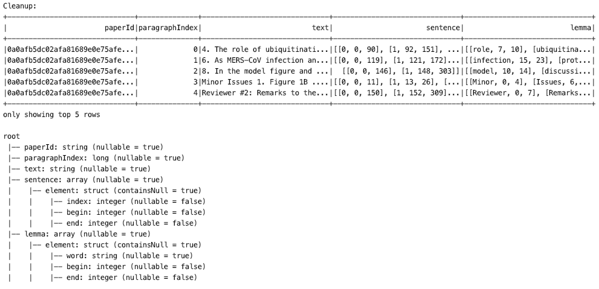

Hier einmal Auszugsweise, dass über das Schema die einzelnen Daten der Tabelle in ein Datentyp konvertieren kann. Semi-strukturierte Daten (wie zum Beispiel in der Sentence Spalte) werden als sogenannte Structs beziehungsweise als Array von Structs interpretiert. Ein Struct ist lediglich eine untypisierte Häufung von Daten. In ihr können sowohl strukturierte/primitive Daten enthalten sein, jedoch auch kaskadierend weitere Structs. Um mit den Elementen eines Structs arbeiten zu können, müssen diese elementweise umgewandelt werden.

Nun stellt sich jedoch auch noch die Frage, wie eine Tabellentransformation und -manipulation vonstattengeht: Dafür bietet Spark mit Einführung der DataFrames die UDFs an. Hinter diesem Akronym stehen die User Defined Functions, also selbstdefinierte Funktionen. Über diese UDFs können neue Tabellenspalten erzeugt werden, welche komplexe Datenzusammenstetzungen ermöglichen.

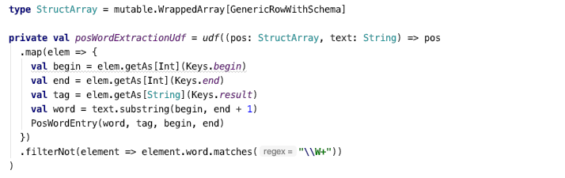

#### [5.1.7] Überblick Verwendete Pipelines

In diesem Kapitel seien einige der in diesem Projekt verwendeten Pipelines näher beschrieben. Um die Einbettung der Pipelines innerhalb eines Experiments zu betrachten, sei auf den Abschnitt Experiment-Klassen verwiesen. Der Datenfluss als Ganzes ist schließlich primär im Code nachzuverfolgen, da eine derartige Betrachtung hier den Rahmen sprengen würde.

##### [5.1.7.1] Preprocessing

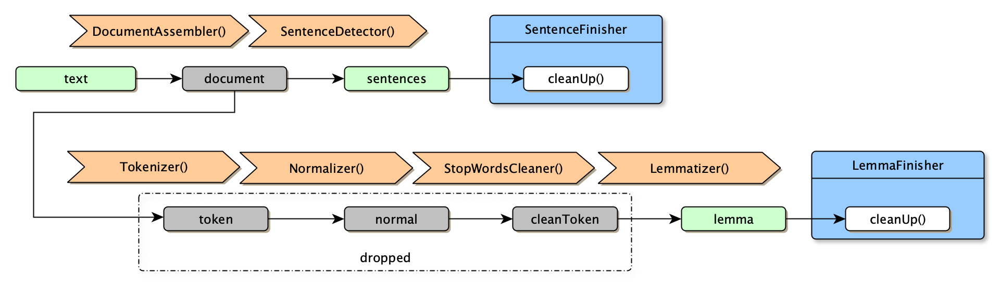

Die PreprocessingPipeline nimmt basale Operationen auf den Eingabetexten vor mit dem Ziel, das Kernvokabular in Form von Lemmas zu erstellen. Auf dem Weg dahin liegen als zusätzliche Datenartefakte die Text-Tokens, die normalisiert und um die Stop-Words (Füllwörter mit wenig inhaltlicher Bedeutung) bereinigt werden. In diesem Durchlauf ermitteln wir zudem die Zerlegung von Paragrafen in Sätze. In diesem Prozess entstehen sehr viele zusätzliche Spalten, die wir im Folgenden nicht benötigen werden. Daher bereinigen wir diese (drop columns) anschließend, um den Datensatz so schlank als möglich zu halten. Des Weiteren erzeugt der Lemmatizer von Spark NLP sehr viele Metadaten, die im Grunde genommen Informationen duplizieren, die bereits in existierenden Spalten vorgehalten werden. Aus diesem Grund wurde eine`LemmaFinisher`-Modul entwickelt, welches die Informationen reduziert und entsprechend der Projektanforderungen umbaut. Gleiches gilt für die Satzspalte, die mit `SentenceFinisher` bereinigt wurde. An dieser Stelle sei einmalig ein Auszug aus der Kommandozeilenausgabe eines Pipelineabschnitts dargestellt, um die Verbindung von DataFrame-Struktur und Pipeline zu veranschaulichen.


##### [5.1.7.2] PoS (Part of Speech)

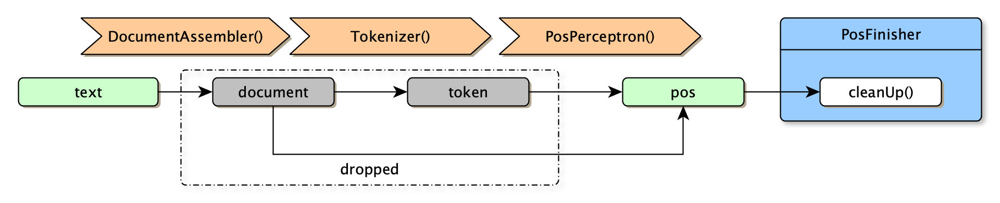

Das Ziel der Part-of-Speech-Pipeline ist die grammatikalische Analyse von Sätzen. Die einzelnen Wörter werden entsprechend ihrer Zuordnung zu den Sprachelementgruppen (Substantiv, Verb, Adjektiv etc.) gekennzeichnet. Mit dieser Technik lassen sich in Zukunft vielleicht genauere Bedeutungszusammenhänge oder Einordnungen erstellen. Insbesondere für die Sentimentanalyse könnte es ausschlaggebend sein, ob ein Wort z. B. ein qualifizierendes Adjektiv ist oder als Adverb ein betroffenes Verb einfärbt. Die Pipeline nutzt eine vortrainiertes ML-Modell (Perceptron = Neuronales Netz) und ist relativ leistungshungrig. Daher wurde entschieden, diesen Algorithmus nur auf Sätzen laufen zu lassen, die Idikatoren-Wörter für unsere Risikofaktor-Analyse (Smoking) enthalten. Das heißt der Eingabetext sind hier die herausgefilterten Sätze. Wieder entstehen bei der PoS-Analyse zu umfangreiche Daten, die wir in einem `PosFinisher` restrukturieren.

##### [5.1.7.3] CountVectorizer & MinHash

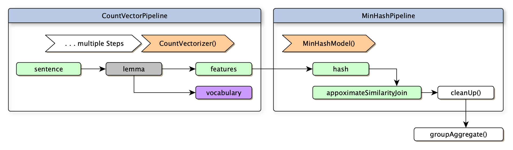

Die Aufgabe eng verknüpften CountVector- und MinHash-Pipelines ist das Finden von ähnlichen Sätzen. Konkret bedeutet dies, dass zu jedem relevanten Satz eine Handvoll ähnlicher Sätze gefunden werden soll. Wie oben (unter CountVectorizer) beschrieben, wandeln wir die Sätze zunächst in eine Vektorform um. Dabei erhalten wir für jeden Satz einen Vektor mit n Dimensionen, wobei n der Länge der gleichzeitig erstellen Vokabularliste entspricht. Auch wenn die Operation für die Ermittlung der Vektordistanz (oder auch die Cosinus-Ähnlichkeit) halbwegs effizient ist, steigt der Aufwand rasant an, wenn wir jeden Satz mit allen anderen vergleichen. Daher wurde in einem zweiten Schritt das MinHashing (in der LSH-Variante) eingesetzt. Dieses Modell erlaubt einen wesentlich performanteren Vergleich über den `approximateSimilarityJoin`. Das Resultat entspricht einem gefilterten Kreuzprodukt: Es entsteht ein DataFrame mit paarweisen Zuordnungen von ähnlichen Sätzen.

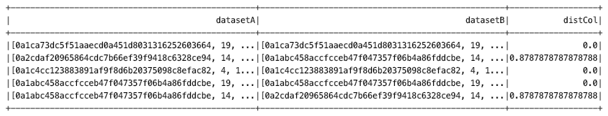

Da nun die Daten in zwei Spalten (doppelt) vorliegen, müssen wir eine Spalte deutlich reduzieren - schließlich interessieren uns nur die Schlüsselattribute der ähnlichen Sätze in `datasetB`. Darüber hinaus haben wir in jeder Zeile nur eine Paarung. Wir müssen also nach den Schlüsseln in `datasetA` gruppieren (Aggregation in Spark SQL).

#### [5.1.8] FileIO & Json

##### [5.1.8.1] Cleaning Pipeline

Bevor unsere einzelnen Pipelines und Experimente gestartet werden, haben wir zunächst die Daten gesäubert. Dabei wurden einige Informationen aus dem Datensatz (z. B. Quellen der Zitate, Danksagungen, Metadaten wie Autoren etc.) entfernt, da nur der tatsächliche Text der Ausarbeitung interessiert. Der Grund für die Vorverarbeitung liegt neben einem Gewinn an Übersichtlichkeit darin, dass unsere Lese- und Schreibvorgänge deutlich beschleunigt werden, sodass die gesamte Laufzeit der Pipeline reduziert wird. Des Weiteren wurde extra Felder wie zum Beispiel der Index des Paragraphs hinzugefügt. So können diese im Nachhinein auch sicher wieder in chronologische Reihenfolge angeordnet werden, weil der Verlust der Ordnung durch das verteilte Rechnen möglich ist.

##### [5.1.8.2] JSON File Utils

In den JsonFileUtils tragen sich alle I/O-Operationen zusammen. Es stellt die zentrale Schnittstelle zum Speichern und Laden von JSONs dar.

#### [5.1.9] Ausführung auf Cluster

Da kein einzelner Rechner die Rechenleistung hat, die 200.000+ Artikel zu verarbeiten, lassen wir dies auf dem Uni-Cluster berechnen. Damit jeder Knoten eine Möglichkeit hat auf die Dateien zuzugreifen, wird das sogenannte Hadoop Distributed File System genutzt, welches allen Teilnehmern des Clusters einen performanten Zugriff auf die gemeinsamen Ressourcen ermöglicht.

##### [5.1.9.1] Cluster HDFS vs. Lokale Testdaten

Das Hadoop Distributed File System ist ein verteiltes Dateisystem, welches einen hoch performanten Dateizugriff in einem Hadoop-Cluster ermöglicht. Es teilt die gespeicherten Dateien auf mehreren Knoten im System, sodass eine Fehlertoleranz gegeben ist, falls ein Knoten des Clusters abstützt und nicht mehr verfügbar ist. Es verwendet dabei eine Master/Slave-Architektur, sodass ein Knoten die Operationen für das gesamte Dateisystem steuert und verwaltet.

Da wir jedoch auch lokale Ausführungen haben, um beispielsweise neue Pipelines auf einem kleineren Datensatz zu testen, wollen wir dies aus Performanzgründen natürlich nicht über das Hadoop Filesystem laufen lassen. Aus diesem Grund ist es nötig, per Command Line Argument zu entscheiden, wie die Dateipfade zu interpretieren sind: Lokal oder verteilt über HDFS. Daher gibt es unterschiedliche Starter-Klassen (Eintrittspunkte) innerhalb des Projekts. Je nach Einsatzgebiet, lokal oder HDFS, werden die Dateipfade angepasst, sodass der Zugriff entsprechend erfolgen kann.

### [5.2] Web-Anwendung

#### [5.2.1] Play Framework

Da der Schwerpunkt des Seminars auf der Programmiersprache Scala liegt, ist auch die Webanwendung auf Basis eines Scala-Frameworks entstanden. Die Wahl fiel dabei auf ein Produkt der Firma Lightbend: Play. Es ist wie Scala an die JVM gekoppelt, was auch Java-Entwicklern einen relativ einfachen Einstieg erlaubt. Das Framework ist Open Source und wird von vielen IDEs direkt unterstützt - so auch von IntelliJ. Daneben sind weitere Eigenheiten erwähnenswert:

- Play ist komplett an funktionalen Konzepten orientiert, auch wenn eine Nutzung unter Java möglich ist. Das Framework favorisiert eine API-zentriertes RESTful Design. Somit gibt es keinen Sitzungszustand. Die Vermeidung von zustandsspeichernden Systemen entspricht dem funktionalen Paradigma.
- Als reaktives Framework kann Play mehrere Anfragen parallel beantworten. Dabei greift es auf die Funktionen von AkkaHttp (inkludiert) zurück. Als Implementierung des Actor-Modells vereinfacht Akka das Arbeiten mit Nebenläufigkeit und ermöglicht so eine horizontale Skalierung der Anwendung. Dies ist eine interessante Parallele zu den in der NLP-Pipeline genutzten Spark-Frameworks.

#### [5.2.2] Architektur

Play folgt in Grundstruktur und Paradigma anderen ConventionOverConfiguration-Frameworks, wie SpringMVC, Ruby On Rails oder Django. Somit stellt es die üblichen Kernkomponenten einer ModelViewController-Architektur und dazu passende Mechanismen bereit:

- Konfiguration der von Klassen und Methoden über vielfältige Annotationen.

- Lose Kopplung der einzelnen Komponenten durch Dependency-Injection.

- Kernmodul als Einstiegspunkt und zum Aufsetzen von Bindings.

- Controller, welche die REST-Endpunkte enthalten und somit HTTP-Anfragen erhalten.

- Services, die weitere Anwendungslogik enthalten, die von den Controllern genutzt werden.

- Repositories, welche eine Abstraktion für den Zugriff auf die Persistenzschicht bilden.

- Views (via Templates), die als HTML an den Browser gehen und dort gerendert werden.

Unsere Webanwendung setzt sich dementsprechend aus folgenden Klassen zusammen:

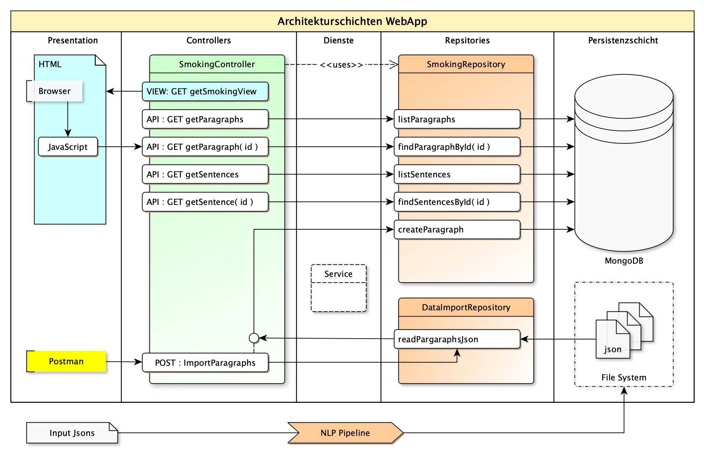

Im Folgenden soll näher auf die einzelnen Module eingegangen werden.

#### [5.2.3] Persistenzschicht

Die für die Webanwendung notwendige Datenbank gehört eigentlich nicht zum Umfang des Play-Frameworks und ist ein unabhängiger Dienst. Da diese vorgehaltenen Daten in Art und Umfang jedoch stark auf die Anforderungen der Webseite angepasst wurden, sei die entsprechende Logik jedoch hier eingeschoben.

##### [5.2.3.1] Auswahlkriterien für MongoDB

Wir haben uns aus mehren Gründen für die dokumentenbasierte (NoSQL) Lösung, MongoDB, entschieden:

1. Der Großteil der von Kaggle bereitgestellten Ausgangsdaten liegt im JSON-Format vor. Insofern basiert die FileIO der NLP-Pipeline auf entsprechenden JSON-Readern und Writern. Dementsprechend wurden auch als resultierende Datenartefakte JSON-Dateien erzeugt. Da MongoDB auf JSON als Dokumentformat und JavaScript als Query-Sprache aufsetzt, ist eine Übertragung der Daten in die Datenbank sehr direkt und zeiteffizient. Im Wesentlichen ist dafür zu sorgen, dass die in der NLP-Pipeline erzeugten Dateien mit dem Datenbankschema konform sind. Ist dies gegeben, dann können die Datensätze mit minimaler Anwendungslogik und sparsamen Datenbankoperationen eingefügt werden.
2. Auch in der Webanwendung werden - wie bei REST gängig - JSON-Objekte als Payload der HTTP-Anfragen und Antworten verwendet. Wenn die in der Datenbank gespeicherten Datensätze, hier also Dokumente, auch den Informationspaketen entsprechen, die vom Frontend angefordert werden, dann ist auch hier die Abfrage äußerst effizient. Komplexe Datenbankabfragen und die bei SQL üblichen Fremdschlüsselaggregationen bzw. Tabellen-Joins sind nicht notwendig, da alle Informationen in einem Dokument gebündelt vorliegen.
3. Diese Bündelung vereinfacht auch die horizontale Skalierung des Datenbanksystems. Dies ist eine wesentliche Stärke der MongoDB und im Kontext von Spark und Akka angemessen. Die Frage ist somit, ob die in relationalen Datenbanksystemen möglichen Tabellenverknüpfungen und das Vermeiden von Datenduplikaten für unseren Anwendungsfall relevant sind: Dies ist nicht der Fall, da der wesentliche Teil der Informationsaggregation durch unsere NLP-Pipeline geleistet wird. Diese Vorverarbeitung erzeugt Metadaten, die im Datensatz eingebettet vorliegen und komplexe Datenbankaggregationen vorwegnehmen. Dies bedeutet, dass Spark für uns im Vorfeld Relationen analysiert und speichert. Bei dem gegebenen Umfang der Daten wäre dies zum Zeitpunkt der Anfrage auch nicht machbar. Die entsprechenden Metadaten lassen sich wiederum in der baumartigen Struktur einer JSON-Datei viel besser als in einer Tabellenzeile abbilden.

##### [5.2.3.2] Deployment und Tools

MongoDB kann zügig mit Docker aufgesetzt werden. Dazu ist ein passendes Image vom Repository, Docker Hub, zu beziehen und eine einfacher Container mit entsprechenden Portfreigaben zu instanziieren.

```bash
$ docker pull mongo
$ docker run -d -p 27000:27017 --name nlp-mongo mongo:latest
$ start nlp-mongo
$ docker exec -it nlp-mongo bash
$ mongo
```

Die weiteren Grundlagen (Einrichtung der Datenbank und Nutzerrechte) können dann mit der bash-Shell innerhalb des Containers vorgenommen werden. Anschließend ist die Datenbank über einen MongoDB-Editor, wir verwenden hier Robo3T, zu editieren. Mit diesem Tool wurden Collections für Dokumente mit passenden Schemata eingerichtet.

##### [5.2.3.3] Datenstruktur (Schema)

Eine genaue Anleitung zum Aufsetzen der Datenbank sowie die Befehle zum Erstellen aller Schemata befindet im Repository des Projekts unter `Docs/database/README.md`. An dieser Stelle sei dementsprechend nur die grundlegende Systematik der Datenstruktur erläutert.

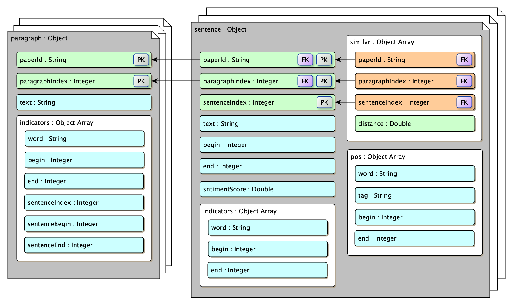

In der MongoDB wurden zwei Sammlungen (Collections) angelegt: Paragraphs und Sentences.

Parargaphs enthält die aus dem Grunddatensatz extrahierten Paragrafen, welche Textbausteine enthielten, die auf den analysierten Indikator (Smoking) deuten. Dementsprechend findet sich innerhalb dieser Dokumente eine Liste von Indikatoren. Diese wiederum enthalten das eigentliche Wort und Indizes, d. h. Koordinaten innerhalb des Paragrafen. Mithilfe dieser Koordinaten lässt sich der Paragraf entsprechend auszeichnen (Highlighting). Paragrafen sind eindeutig über die ID des Papers und einen fortlaufenden Index identifiziert.

Sentences sammelt nun die spezifischen Sätze aus den Paragrafen, die den Indikator enthalten. Als Schlüssel verwenden wir gleichzeitig den Verweis auf den Quellparagrafen: PaperID und ParagraphIndex. Dazu kommt ein Index für den Satz. Die Sätze sind über Textkoordinaten im Paragrafen zu verorten. Dazu erhalten wir Informationen zum Indikator (Smoking-Wort), diesmal aber mit Koordinaten relativ zum Satz. Des Weiteren finden sich Auszeichnungsinformation zur grammatikalischen Sprachanalyse (POS = Part of Speech) und schließlich eine Sammlung von Schlüsseln zu ähnlichen Sätzen mit entsprechendem Vektorabstand.

#### [5.2.4] Repositories

Die Repositories bilden die Abstraktion des Zugriffs auf die Persistenzschicht. Sie stellen die für das Projekt benötigten CRUD-Operationen zu Verfügung und werden von den REST-Controllern genutzt.

##### [5.2.4.1] SmokingRepository & Reactive Mongo

Für die Anbindung der Datenbank wird das SmokingRepository verwendet. Für die Implementierung nutzen wir das Framework *Reactive Mongo*, welches asynchrone, nicht-blockierende IO-Operationen für den Zugriff auf die MongoDB unter Scala ermöglicht. Insofern passt es hervorragend zu Play und dessen AkkaHttp Bausteinen. Der wesentliche Vorteil liegt darin, dass ein langwieriger Datenbankzugriff nicht länger den Thread blockiert, sondern frei gegeben wird, bis die Antwort eintrifft. Damit reduziert sich die Anzahl der benötigten und oft eingefrorenen Threads deutlich - die Anwendung skaliert besser. Diese Architektur wird in den durchgängig auftretenden `Future` - Datentypen deutlich. Insbesondere Rückgabetypen sind ein Versprechen auf ein zukünftig eintreffendes Ergebnis. Die entsprechende Methode gibt den Thread frei und nimmt die Ausführung zu einem späteren Zeitpunkt wieder auf.  

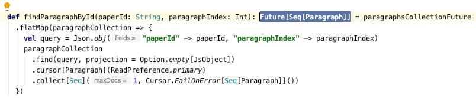

Der Code-Auszug veranschaulicht auch den grundlegenden Ablauf der Datenbankanfrage:

1. Wir greifen auf eine zuvor erstellte Verbindung zur Mongo-Collection zu.

2. Ein Query-Object (selbst ein JSON), sowie eine Projektion werden erstellt.

3. Wir nutzen einen Cursor, um die passenden Datensätze zusammen zu sammeln.

4. Im Controller wird schließlich das Resultat aus dem `Future` extrahiert, sobald es eintrifft.

Die für unser Projekt notwendigen Lese-Operationen auf die MongoDB sind:

```scala
// zieht alle Paragraphen (Limit für Pagination), um diese auf der Webseite anzuzeigen
def listParagraphs(limit: Int = 100)
// zieht alle Sätze (Limit für Pagination), um diese auf der Webseite anzuzeigen
def listSentences(limit: Int = 50)
// findet die Indikator-Sätze zu einem spezifischen Paragraphen
def findSentencesByParagraph(paperId: String, paragraphIndex: Int)
// findet einen spezifischen Indikator Satz (Verwendung beim Abruf ähnlicher Sätze)
def findSentencesById(paperId: String, paragraphIndex: Int, sentenceIndex: Int)
// findet einen spezifischen Paragraphen, also von einem Satz ausden Kontext
def findParagraphById(paperId: String, paragraphIndex: Int)
```

Dazu kommen die Operationen, welche für den Datenimport genutzt werden.

```scala
// fügt Pargraphen in der Datenbank ein
def createParagraphs(paragraphs: List[Paragraph])
// fügt Sätze in der Datenbank ein
def createSentences(sentences: List[Sentence])
```

##### [5.2.4.2] ImportDataRepository

Auch der Datenimport in die MongoDB wird über die Webapplikation durchgeführt. Diese Strategie verhindert, dass die NLP-Pipeline (ein eigenes autarkes Projekt) ebenfalls über Code für den Datenbankzugriff verfügen muss. Dabei werden die Daten jedoch nicht etwa über REST-versendet. Vielmehr triggert der REST-Call, ausgeführt via Postman, nur das Importieren der Daten. Das Backend greift also lediglich auf das lokale Dateisystem zu, liest die JSON-Dateien aus dem Pipeline-Prozess ein und schickt diese an die Datenbank. Für die FileIO auf das besagte lokale Dateisystem wird das ImportDataRepository verwendet. Dieses verfügt über die entsprecheden Methoden zum Parsen von JSONline-Dateien, die zuvor von Spark produziert wurden. Eine Anleitung zum Datenimport mit den geeigneten Postman-Requests findet sich im Projektrepository unter `Docs/database/README.md`.

#### [5.2.5] Modell-Klassen (Entitäten)

Um die in der MongoDB aufgebauten Datenstrukturen in Scala als Objekte abbilden zu können, benötigen wir entsprechende Klassen im Backend. Da die JSON-basierte Dokumentstruktur der MongoDB deutlich dichter an der Objektwelt liegt als Tabellen bei relationalen Datenbanksystemen, ist dies denkbar einfach - wir haben hier kein *object-relational impedance mismatch*. In Scala können Objekte für Entitäten ideal mit Case-Klassen erstellt werden. Damit eine automatische Konvertierung der Objekte nach und von JSON bzw. Mongos BSON über das Play Framework erfolgen kann, fügen wir lediglich eine implizite Formatierungsmethode als Einzeiler ein. Dieser Mechanismus funktioniert auch ohne Weiteres für Objektbäume mit Referenzen auf weitere Objekte.

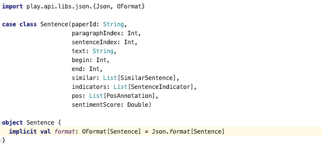

#### [5.2.6] REST-Controller & URL-Routen

##### [5.2.6.1] Asynchroner Controller

Der SmokingController nimmt alle HTTP-Anfragen zum Thema Smoking-Indikator von der Webseite entgegen. Er erinnert im Aufbau stark an einen Spring-Controller, den wir aus der Java-Welt kennen. Dependencies für den genutzten Ausführungskontext und die angebunden Repositories werden im Konstruktor automatisch durch das Play-Framework injiziert. Interessant ist jedoch, dass der Controller als Singleton vorliegt. Hier wird also nicht für jede Anfrage eine gesonderte Instanz erstellt.

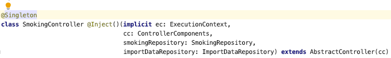

Insofern ist es wichtig, dass die Anfragen als nicht-blockierende, asynchrone Aufrufe abgearbeitet werden und geteilter Zustand innerhalb des Controllers um jeden Preis vermieden wird. Auch hier ist wieder die DNA des zugrunde liegenden AkkaHttp-Frameworks ablesbar.

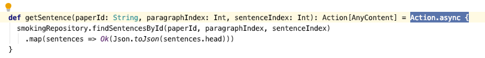

##### [5.2.6.1] Routen-Konfiguration

Das Play-Framework verfügt grundsätzlich über eine Vielzahl von Optionen, um die Methoden des REST-Controllers auf die passenden URL-Adressen zu Mappen. Die einfachste und zunächst übersichtlichste ist eine Auflistung innerhalb einer Konfigurationsdatei im Ressourcen-Ordner `conf/routes`. Die wichtigsten Routen seien hier verkürzt gelistet:

```python
# Anfrage des HTML-Views zur Webanwendung
GET /smoking                            
	=> SmokingController.getSmokingView
# API-Anfrage der Sätze
GET /smoking/api/sentences              
	=> SmokingController.getSentences
# API-Anfrage der Paragraphen
GET /smoking/api/paragraphs             
	=> SmokingController.getParagraphs
# API-Anfrage der Sätze zu einem selektierten Pargraphen
GET /smoking/api/sentences/paragraph
	=> SmokingController.getParagraphSentences(paperId: String, paragraphIndex: Int)
# API-Anfrage der Sätze zu einem spezifischen Sätz (selektiere ähnliche Sätze)
GET /smoking/api/sentence
	=> SmokingController.getSentence(paperId: String, paragraphIndex: Int, sentenceIndex: Int)
# API-Anfrage eines spezifischen Paragraphen
GET /smoking/api/paragraph
	=> SmokingController.getParagraph(paperId: String, paragraphIndex: Int)
# Route zum Auslösen des Dartenimports von Sätzen (lese JSON von lokal)
POST /smoking/import/sentences
	=> SmokingController.postSentencesImportCommand
# Route zum Auslösen des Datenimports von Paragraphen (lese JSON von lokal)
POST /smoking/import/paragraphs
	=> controllers.SmokingController.postParagraphsImportCommand
```

- **JSON API:** Die Routen, welche ein `/api/` enthalten sind klassische REST-Methoden im Sinne eines Backend-API-Zugriffs im MicroService-Konzept. Sie liefern immer JSON-Payloads zurück, die auch über Postman getestet wurden. Ein Aufruf dieser Routen im Browser rendert die JSON-Dateien.
- **Daten Import:** Die Routen mit `/import/` dienen ausschließlich zum Auslösen des Imports der JSONs aus der NLP-Pipeline in die MongoDB. Wir erhalten hier nur die Anzahl der Importe zurück. Wie unter *DataImportRepository* erläutert, werden keine Daten in diesen Command-Calls mitgegeben. 
- **HTML View:** GET /smoking` liefert einen View und fungiert somit als HTML-Webserver.

#### [5.2.7] Frontend Views & JavaScript 

##### [5.2.7.1] Scala HTML Templates

Vergleichbar mit den Frameworks Django (Python) und Laravel (PHP) bietet auch das Play Framework einen Template-Mechanismus zum serverseitigen Rendering von dynamisch erzeugten HTML-Views. Derartige Konzepte setzen zumeist auf eine hybride Syntax, die reines HTML um dynamische Elemente aus der Programmiersprache des Frameworks erweitert. So finden wir in den mit `.scala.html` markierten View-Dateien neben den HTML-Blöcken auch mit @ annotierte Funktionen, die der Scala-Syntax entsprechen. Damit lassen sich bei Erzeugung des Views Parameter hereinreichen, Schleifen durchlaufen und bedingte Anweisungen ausführen. Der View wird auf diese Weise dynamisch vom Backend zusammengebaut, bevor er als reines HTML an den Browser geht.

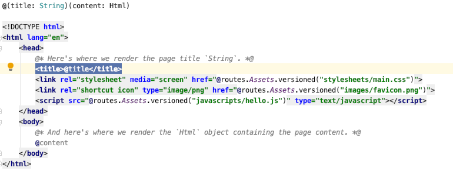

##### [5.2.7.2] JavaScript (AJAX) & JSON API

In diesem Projekt lieferte das serverseitige Rendering nicht die gewünschte Flexibilität, sodass auf clientseitige Modifikation der HTML-Seiten via JavaScript (AJAX mit Json) zurückgegriffen wurde. Demnach enthalten die HTML-Seiten JavaScript-Code, der beim Laden im Browser ausgeführt wird. Im JavaScript finden sich asynchrone Http-Anfragen, welche an die API-Routen des Backends gehen, um die inhaltlichen Informationen (Paragrafen und Sätze) in Form von JSON-Payloads anzufragen. Mit diesen Informationen wird dann im Browser der DOM-Baum der HTML-Seite manipuliert und so ein neuer View dynamisch generiert. Der Ausführungsfluss ist in folgendem Diagramm exemplarisch dargestellt:

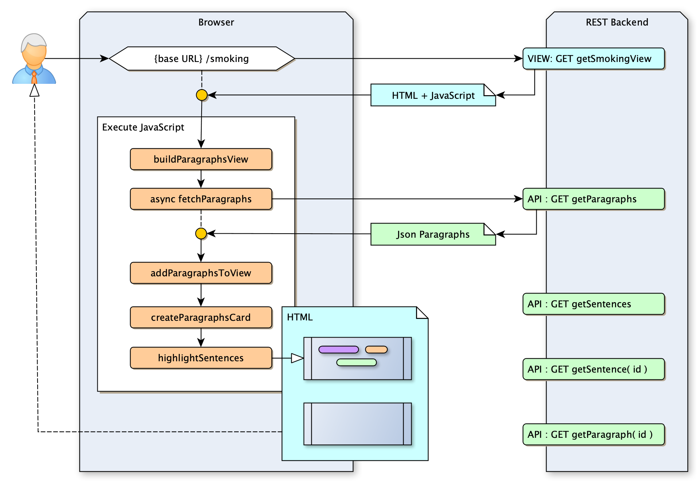

##### [5.2.7.3] HTML-Komponenten mit Vanilla JavaScript

Da die Webentwicklung nicht im Vordergrund dieser Arbeit stand und bereits mehrere recht diverse Technologien eingesetzt wurde, haben wir bei der Erstellung des Frontends auf die Nutzung eines komplexen Frameworks wie React oder Angular verzichtet. Dies hätte sonst einen weiteren, fast eigenständigen Dienst zur Folge gehabt. Dementsprechend wurde auf der Browser-Seite auf pures JavaScript mit CSS genutzt. Für das Styling wurde die schlanke CSS Bibliothek *Material Design Lite* eingebunden. Ohne ein Komponentensystem (wie es z. B. von React angeboten wird), ist die dynamische Erstellung von View-Bausteinen - hier die Karten für jeden Textparagrafen - jedoch nicht ganz so trivial. Wir benötigen also eine Methode, mit der HTML-Bausteine im Seitentext angegeben werden können, ohne diese direkt zu rendern. Vielmehr dienen diese Blöcke als Vorlage im DOM-Baum. Sie sollen dann von JavaScript erfasst, mehrfach instanziiert und manipuliert werden. Erst die so erzeugten Komponenten werden nach Übergabe an den DOM-Baum vom Browser gerendert. Genau für diesen Zweck gibt es in HTML5 das `<template>`-Tag. Mit diesem können Vorlagebausteine im HTML-Quelltext eingepackt werden. Auf diese Weise reduziert sich der zum dynamischen Erstellen der Views benötigte JavaScript Code deutlich.

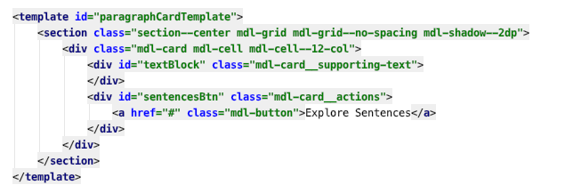

Das Auszeichnen, d. h. das farbliche Markieren von Textabschnitten innerhalb der Paragrafen- und Satztexten, wurde wiederum über klassische JavaScript DOM-Methoden realisiert. Dazu musste der in der Textblock entsprechend der in den JSON-Payloads enthaltenen Textkoordinaten (für POS & Indikatoren) mit String-Operationen zerschnitten und abschnittsweise in HTML-Tags eingebettet werden. Der resultierende HTML-Code wurde schließlich den oben beschriebenen Template-Instanzen beigefügt.

 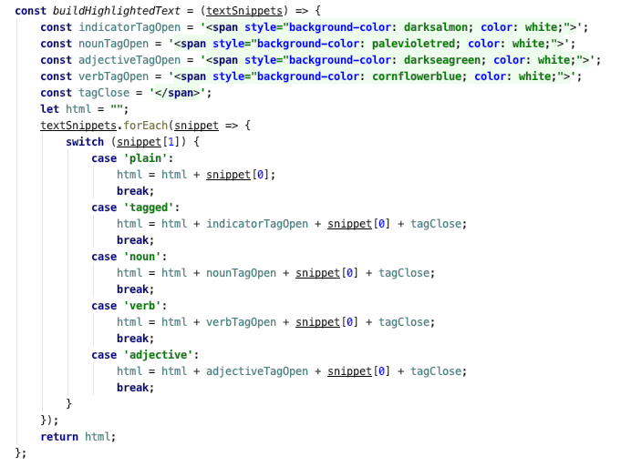

***

## [6] Evaluation der Ergebnisse

Zunächst einmal ist anzumerken, dass Spark NLP und Spark ML traumhaft miteinander funktionieren. So können Natural Language Processing Modelle mit wenig Mühe in bereits etablierte Pipelines aus Spark ML eingefügt werden. 
Des Weiteren ist eine Menge Wissen über die verteilte Bearbeitung von Daten erlangt worden. So ist gerade der Netzwerk-Traffic oft der Bottleneck gewesen. Auch mit Optimierungsverfahren dauert es eine gewisse Zeit, mehrere Machine-Learning-Modelle mit einer Größe von über 200 MB auf alle Knoten zu verteilen. Auch die Kreuzproduktbildung, welche eben zentral stattfinden muss, hat eine Menge Zeit in der Berechnung in Anspruch genommen.

Die Einbindung der Daten über die verschiedenen Dateisysteme war zunächst auch eine Herausforderung. Die Dateipfade je nach lokaler- oder HDFS-Ausführung zusammenzufügen, erforderte einen gleichen Aufbau der Ordnerstruktur sowohl lokal als auch im Hadoop Distributed Filesystem. So führte es oft zu NullPointerExceptions, weil die Pfade nicht exakt so existierten, wie zunächst vermutet.
Insofern war auch SparkSQL und damit SparkML schwer zu testen und debuggen, insbesondere wenn Fehler erst spät auftreten. 

Die Visualiserung der Daten bei der Exploration hingehen wurde maßgeblich durch den Einsatz von spezialiserten Python libraries vereinfacht. MatplotLib und Rasa's whatlies bieten mit Pandas gut integriererbare und vielfältige Visualisierungsoptionen, die so in Scala kaum oder garnicht verfügbar sind. Angeboten hat sich dabei auch, mit NLP Libraries wie Spacy die letzten Aufbereitungsschritte wie Sprachanalysen zu machen, während mit Scala die Daten heruntergekocht und aufbereitet wurden. 
An dieser Stelle greifen Sparks performante Datenverarbeitung und Pythons hohe Bedienbarkeit und Versitilität gut ineinander.

Gute Erfahrungen wurden unter anderen mit Scalas Play Framework für die WebApp gemacht. Gerade Nutzer und Liebhaber von Spring werden sich hier sehr wohlfühlen und die Parallelen zu schätzen wissen. Weiterhin bot der Einsatz von Scala und damit funktionalem Code eine Komponente der Thread Sicherheit als weiteren Mehrwert. 

Generell stellt sich im Bereich Statistik und Big Data das Problem des Beweises der Kausalität. Gerade beim Bearbeiten von unstrukturierten Daten wie Texten scheint die Beweisführung mit unserem Wissenstand nahe unmöglich. Der Zeitaufwand für die Herleitung solcher Aussagen ist enorm, besonders wenn man sich an die wissenschaftliche Etikette hält.

## [7] Fazit

Wie bereits in der Evaluation angedeutet wurde, war es nicht unser Ziel, inhaltliche Zusammenhänge zu vermuten oder zu beweisen, sondern ein Werkzeug zu schaffen, welches es ermöglicht, eine Dimensionsreduktion der Informationen zu schaffen, sodass diese dann später von Dritten genutzt werden können. 
Mit diesem Fokus auf unsere Kernkompetenz der Datenaufbereitung befinden wir uns im Umfeld der anderen Kaggle Submissions in guter Gesellschaft. Die meisten Submission beschäftigen sich mit den Daten auf einer Meta Ebene: Das heißt sie versuchen die Daten nicht inhaltlich zu bewerten, sondern aufzubereiten und greifbarer zu machen. So hoffen wir, einen sinnvollen Beitrag zur Informationsgewinnung über das SARS-CoV-2 Virus leisten zu können. 
Die Stärke der WebApp liegt für Nutzerinnen und Nutzer darin, nicht jede Publikation einzeln lesen zu müssen, sondern mutmaßlich zusammenhängende Informationen vom System aufbereitet abgeboten zu bekommen und so Ergenntnisse schneller gewinnen und erkunden zu können, ohne dabei technisches Know-How über das kompetente Auswerten der Informationen mitzubringen. 

Weiterhin könnte man mit unserer generischen Pipeline auch weitere Risikofaktoren analysieren, welche in der Kürze der Zeit dieses Projektes nicht mit bearbeitet werden konnten. Diese Ausbaufähigkeit hat sich im Laufe des Projekts sehr bewährt, wenn es darum ging neue Ideen umzusetzen.

Weitere Ausbaustufen könnten sein, die derzeitige Ähnlichkeitsanalyse auf Wortebene mit weiteren Metriken wie den SPECTRE Embeddings zu verfeinern und in die Ergebnisfindung einzubeziehen und damit die Relevanz der Ergebnisse auf eine neue Stufe zu heben.

Der Wissensgewinn in diesem Projekt war für uns enorm. So wurden neue Programmieraspekte wie zum Beispiel das effiziente Programmieren für eine verteilte Berechnung erlernt. Funktionale Programmierparadigmen mit Scala wurden gefestigt und auch ein funktionales Backend zu schreiben, ist ein interessanter Erkenntnisgewinn.

## [8] Quellen

https://towardsdatascience.com/introduction-to-spark-nlp-foundations-and-basic-components-part-i-c83b7629ed59

https://medium.com/spark-nlp/spark-nlp-101-lightpipeline-a544e93f20f1

https://medium.com/@ianshan0915/topic-modeling-on-large-scale-corpus-with-spark-9af45b5de603