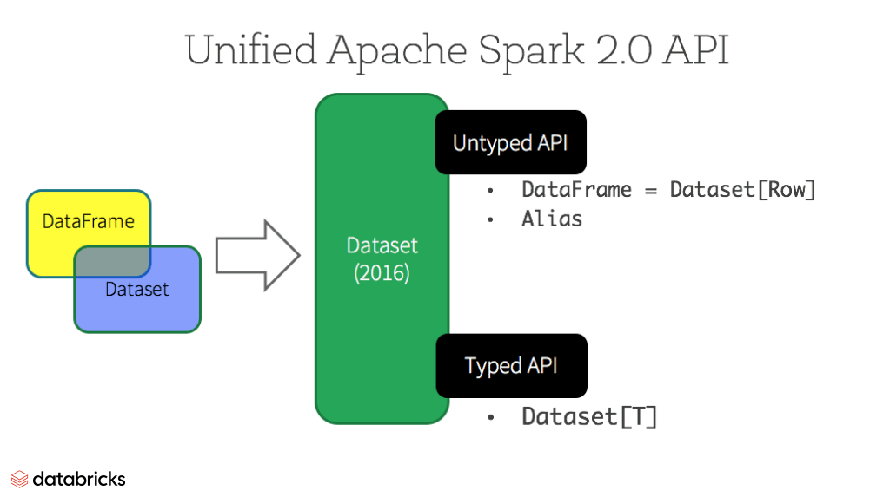

# Daily Reader Online Library
##### Collect useful articles and links here.
***
### Spark Basics
- **DataFrames, DataSets und RDD** - what's the difference?
  
    - **link:** https://databricks.com/de/blog/2016/07/14/a-tale-of-three-apache-spark-apis-rdds-dataframes-and-datasets.html
    - **summary:** This article explains quite clearly the different use cases, advantages and disadvantages foreach one of these data types. Read this shout blog post to understand where to use the specific distributed data option. For most cases DataFrames should be fine. However I find the strongly typed version - the DataSet - prarticularly interesting, as it would remove the need for type casting when extracting information from a DataFrame. RDD is low level, but nevertheless not as efficient.
    
    

- **Spark DataFrames and JSON** - explaination about data coversion
  - **link:** https://sparkbyexamples.com/spark/spark-read-and-write-json-file/
  - **summary:** Detailed explaination about the differnt options to read JSON data into spark DataFrames. Of couse we'll also find the introductions how to write JSONs. This should help us to write a comprehensive File IO.
  - **additional:**
    - One JSON per row: https://stackoverflow.com/questions/54582531/how-to-write-one-json-file-for-each-row-from-the-dataframe-in-scala-spark-and-re 

***

### NLP Workflows and Examples

- **Information Extraction using Python** - hands-on projekt
  - **link:** https://www.analyticsvidhya.com/blog/2020/06/nlp-project-information-extraction/
  - **summary:** Very concise an interesting project overview, which can give you some inspiration and insight how to tackle NLP tasks. Useful if you still wonder, what zou could achieve. Also gives some good explainations about many standard techniqies and the used ML-models. Main framework used throughout the blog post is Python SpaCy. However many approaches can be carried over to Scala. Maybe we even want to mix up the frameworks a bit, especially in early exploration and later data visualisation. We already have a Python module implemented within in our scala project.

